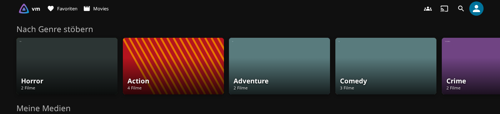
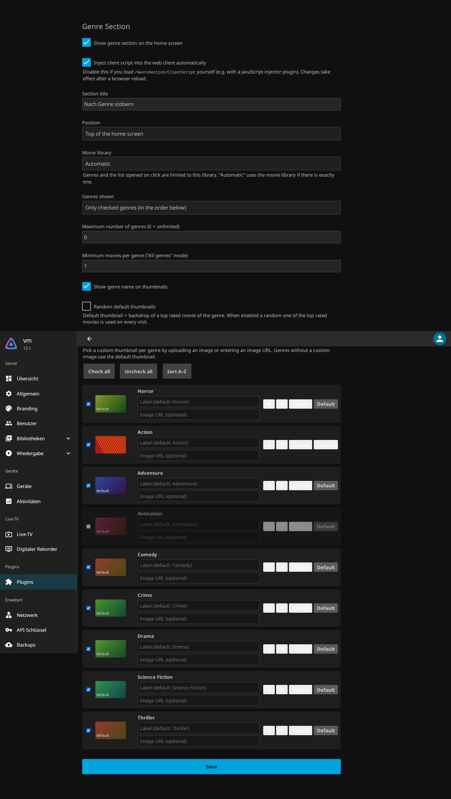

# Jellyfin Genre Section

A Jellyfin plugin (server **12.1**, `net10.0`) that adds a **genre row to the home screen**.
Every genre is a thumbnail; clicking it opens a list of all movies in that genre.



## Features

- Genre section on the home screen (top, bottom, or after home section *n*), with a custom title
- **Default thumbnails**: the backdrop of the highest-rated movie in the genre (optionally a random one
  of the top-rated movies). If a genre has no backdrop, a colored gradient is shown instead.
- **Custom thumbnails** per genre: upload an image or enter an image URL
- Show all genres (alphabetical, with a minimum movie count) or only the checked genres in a custom order
- Optional custom label per genre, and a limit on the number of genres shown
- Click → `#/list?genreId=…&parentId=<movie library>`, which lists only the movies of that genre
- Movie library selectable. "Automatic" uses the single movie library if there is exactly one.

## How it works

| Part | File |
| --- | --- |
| Injects `<script src="../GenreSection/ClientScript">` into `/web/index.html` at runtime (middleware, no files are modified) | `Web/ScriptInjectionMiddleware.cs` |
| Client script: renders the section on the home screen and loads genres and backdrops through the regular Jellyfin API | `Web/genreSection.js` |
| API: `GET /GenreSection/ClientScript`, `GET /GenreSection/Settings`, `GET/POST/DELETE /GenreSection/Images` | `Api/GenreSectionController.cs` |
| Settings page (Dashboard → Plugins → Genre Section) | `Configuration/configPage.html` |

Uploaded images are stored in `<data>/plugins/Jellyfin.Plugin.GenreSection/images/`.

If you would rather load the script with a JavaScript injector plugin, turn off
"Inject client script" and load `/GenreSection/ClientScript` yourself.

## Build & install

```shell
dotnet publish Jellyfin.Plugin.GenreSection.slnx -c Release
```

Copy `Jellyfin.Plugin.GenreSection/bin/Release/net10.0/publish/Jellyfin.Plugin.GenreSection.dll` to
`<jellyfin-data>/plugins/GenreSection_1.0.0.0/` and restart the server. Then reload the web client in the browser.

## Settings


